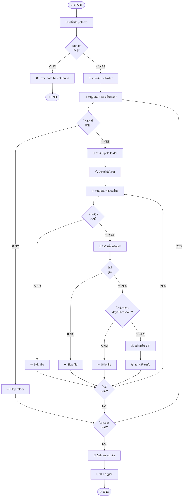
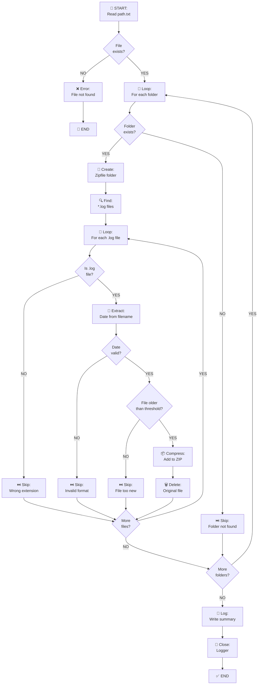
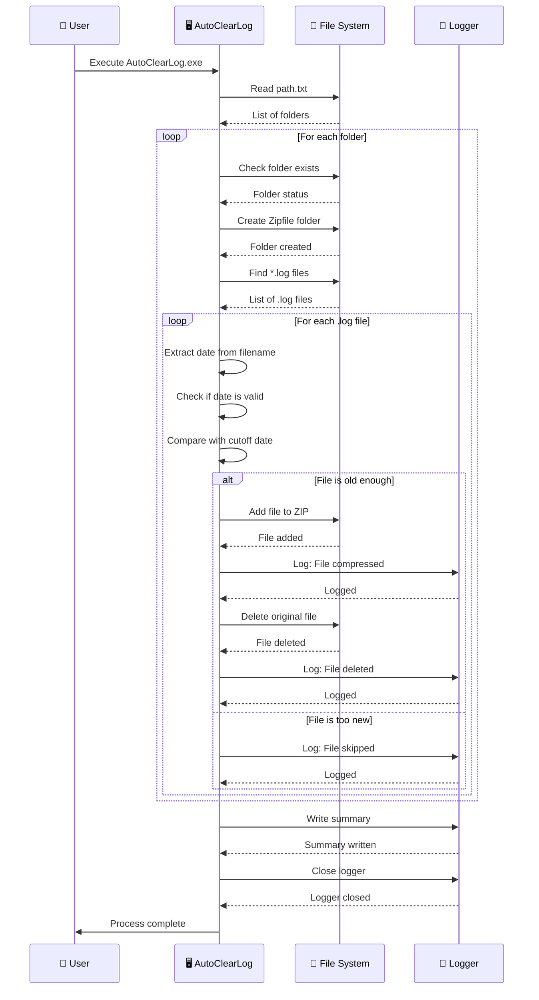
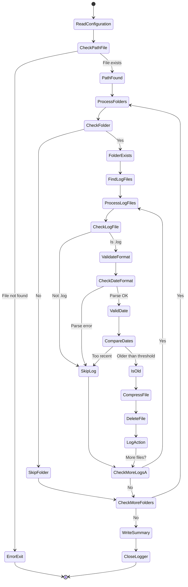
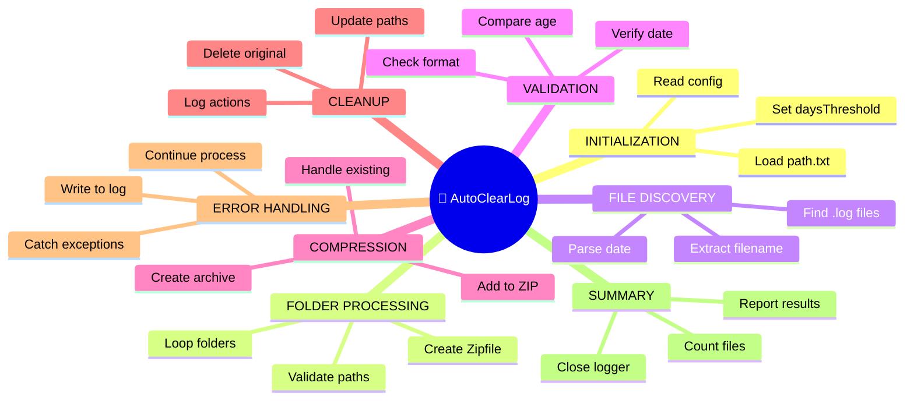
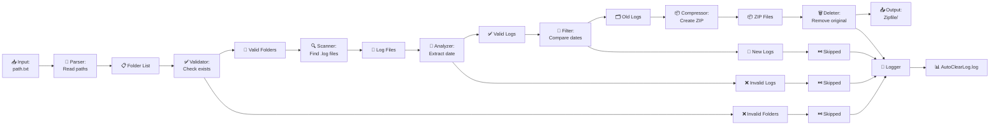
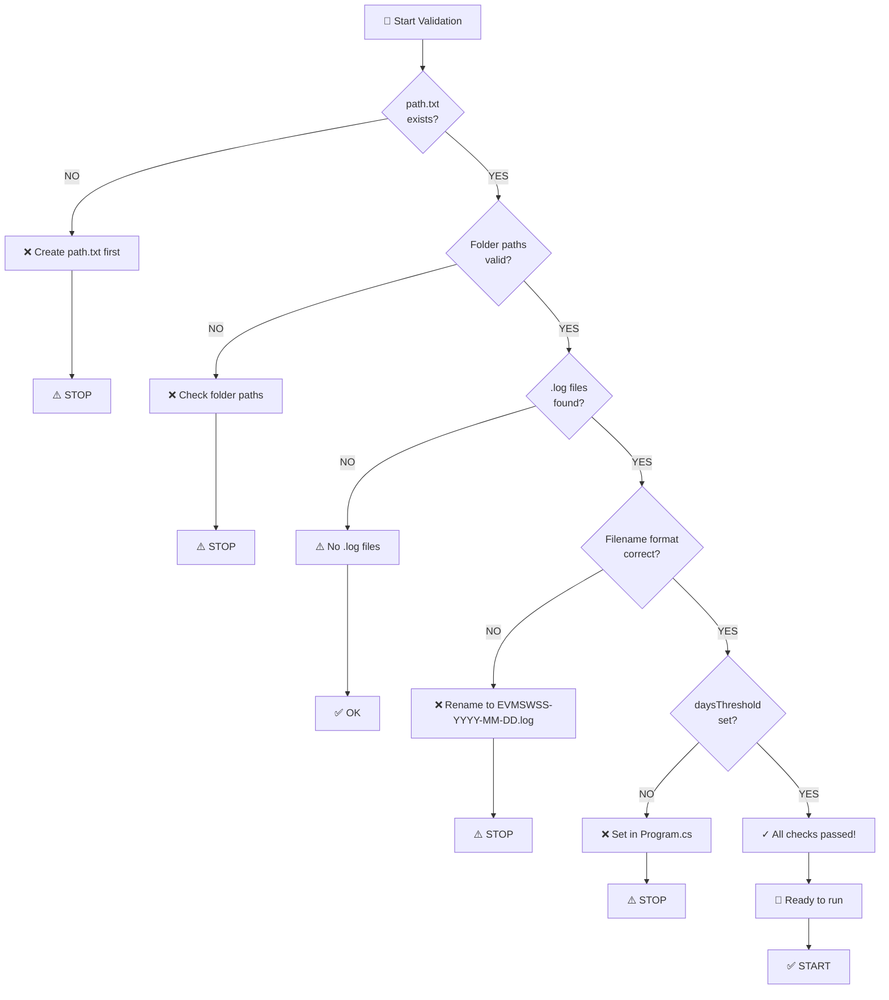
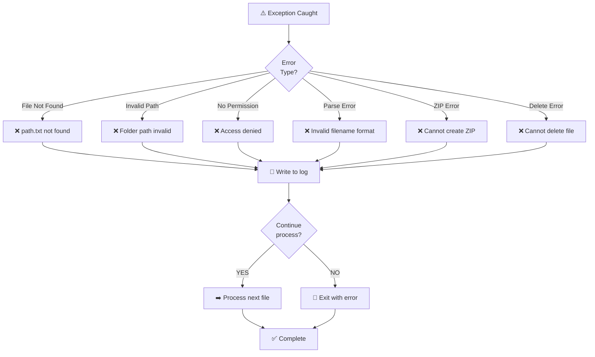

# AutoClearLog - Flowchart Diagram

## 📊 Main Process Flow

---

## 🔀 Decision Tree

---

## ⚙️ Processing Steps

---

## 📊 State Diagram

---

## 🎯 Process Summary Map

---

## 📈 Data Flow Diagram

---

## ✅ Validation Checklist

---

## 🔄 Error Handling Flow

---

**💡 Tip:** These diagrams can be viewed directly in VS Code with the Mermaid extension or on GitHub!
